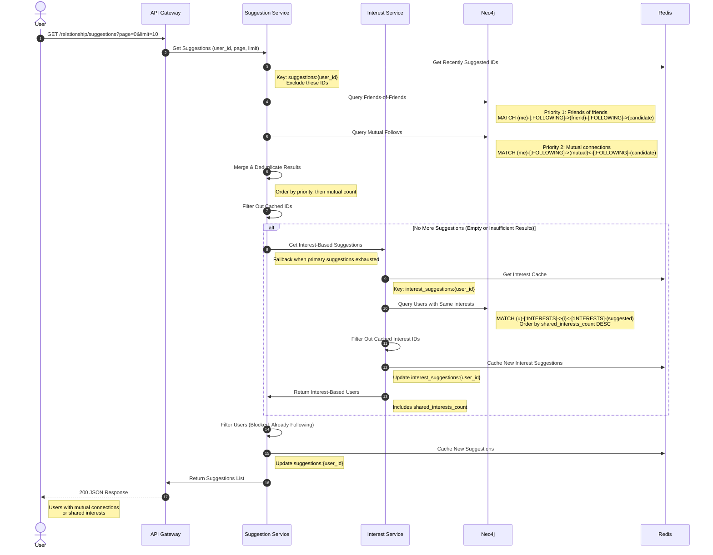

# Basic Use Case Flow Diagrams

This document provides detailed step-by-step instructions for drawing flow diagrams for basic use cases in the Decode Network Backend system.

---

## 1. Wallet Login Flow Diagram

### Overview
Wallet login allows users to authenticate using their Web3 wallet (e.g., MetaMask) by signing a challenge message. This provides passwordless authentication for Web3 users.

### Diagram Type: **Sequence Diagram**

#### Actors/Components to Include:
1. **User/Client** (Web/Mobile App with Wallet)
2. **API Gateway** (Port 4000)
3. **Wallet Service** (Port 4005)
4. **Auth Service** (Port 4001)
5. **Session Service**
6. **Device Fingerprint Service**
7. **MongoDB** (Port 27017) - wallets collection

#### Flow Steps:

**Step 1: User Initiates Wallet Login**
- **User** clicks "Login with Wallet" button
- **User** connects wallet (MetaMask, WalletConnect, etc.)
- Wallet address is retrieved: `0x1234...abcd`

**Step 2: Request Login Challenge**
- **User** sends POST request to `/wallet/auth/login-challenge`
- Request body: `{ "address": "0x1234...abcd" }`
- **API Gateway** receives request
- **API Gateway** forwards to **Wallet Service**

**Step 3: Validate Wallet Exists**
- **Wallet Service** calls `AuthService.generateLoginChallenge()`
- Query **MongoDB** wallets collection:
  ```javascript
  { address: address_lowercase }
  ```
- If wallet not found → return error "Wallet not found"
- If wallet found, check if it's primary wallet

**Step 4: Check Primary Wallet Status**
- **Wallet Service** checks `wallet.is_primary` field
- If `is_primary = false` → return error "Only primary wallet allowed for login"
- If `is_primary = true` → continue

**Step 5: Generate Nonce Message**
- **Wallet Service** calls `CryptoUtils.generateNonceMessage()`
- Generate challenge message:
  ```
  "Decode Network Login\n\nWallet Address: 0x1234...abcd\nNonce: <random_nonce>"
  ```
- Message includes wallet address and random nonce
- Purpose: Prevent replay attacks

**Step 6: Return Challenge to User**
- **Wallet Service** returns challenge message
- **API Gateway** forwards response:
  ```json
  {
    "success": true,
    "data": {
      "nonceMessage": "Decode Network Login\n\nWallet Address: 0x1234...abcd\nNonce: abc123"
    }
  }
  ```

**Step 7: User Signs Challenge**
- **User** receives challenge message
- **User** signs message with wallet private key
- Signature generated: `0xdef456...`
- **User** sends POST request to `/wallet/auth/validate-login-challenge`
- Request body:
  ```json
  {
    "address": "0x1234...abcd",
    "signature": "0xdef456...",
    "fingerprint_hashed": "device_fingerprint_hash",
    "browser": "Chrome 120",
    "device": "Windows 10"
  }
  ```

**Step 8: Validate Signature**
- **API Gateway** forwards to **Wallet Service**
- **Wallet Service** calls `AuthService.validateLoginChallenge()`
- **Wallet Service** calls `CryptoUtils.validateNonceMessage()`
- Verify signature matches:
  - Wallet address
  - Challenge message
  - Signature
- If signature invalid → return error "Challenge validation failed"

**Step 9: Verify Wallet Again**
- **Wallet Service** queries **MongoDB** to get wallet
- Verify wallet exists and is primary
- Extract `user_id` from wallet document

**Step 10: Create Wallet Session**
- **Wallet Service** calls **Auth Service** `createWalletSession()`
- Request includes:
  - `user_id`: From wallet document
  - `device_fingerprint_hashed`: From request
  - `browser`: From request
  - `device`: From request

**Step 11: Check Device Fingerprint**
- **Auth Service** calls `DeviceFingerprintService.checkDeviceFingerprint()`
- Query **MongoDB** device_fingerprints collection
- If device not found or not trusted:
  - Create trusted device fingerprint
  - Create session with new device
- If device found and trusted:
  - Create session with existing device

**Step 12: Create Session**
- **Auth Service** calls `SessionService.createSession()`
- Create session document in **MongoDB**:
  - `user_id`: From wallet
  - `device_fingerprint_id`: From device fingerprint
  - `app`: "decode by wallet"
  - `session_token`: Generated JWT session token
  - `expires_at`: 30 days from now
  - `is_active`: true

**Step 13: Generate Access Token**
- **Auth Service** generates JWT access token
- Token includes: `user_id`, `email`, `username`, `role`, `session_token`
- Expires in: 15 minutes

**Step 14: Return Session Data**
- **Auth Service** returns session data
- **Wallet Service** forwards to **API Gateway**
- **API Gateway** returns to **User**:
  ```json
  {
    "success": true,
    "data": {
      "access_token": "eyJhbGciOiJIUzI1NiIs...",
      "session_token": "session_token_here",
      "user": {
        "user_id": "user123",
        "email": "user@example.com",
        "username": "johndoe"
      }
    }
  }
  ```

**Step 15: User Authenticated**
- **User** receives tokens
- **User** stores tokens in client storage
- **User** is now logged in

### Error Paths:
1. **Wallet Not Found**: Return 400 error
2. **Wallet Not Primary**: Return 400 error "Only primary wallet allowed"
3. **Invalid Signature**: Return 400 error "Challenge validation failed"
4. **Session Creation Failed**: Return 500 error

---

## 2. Set Up Two-Factor Authentication (2FA) Flow Diagram

### Overview
Two-factor authentication adds an extra layer of security by requiring users to provide a time-based one-time password (TOTP) from an authenticator app (e.g., Google Authenticator) in addition to their password.

### Diagram Type: **Sequence Diagram**

#### Actors/Components to Include:
1. **User/Client**
2. **API Gateway** (Port 4000)
3. **Auth Service** (Port 4001)
4. **TwoFactorAuth Service**
5. **MongoDB** (Port 27017) - otps collection
6. **Authenticator App** (Google Authenticator, Authy, etc.)

#### Flow Steps:

**Step 1: User Initiates 2FA Setup**
- **User** navigates to Security Settings
- **User** clicks "Enable Two-Factor Authentication"
- **User** sends POST request to `/auth/2fa/setup`
- Request includes: `Authorization: Bearer <access_token>`
- **API Gateway** receives request
- **API Gateway** validates access token via **AuthGuard**
- Extracts `user_id` from token

**Step 2: Check Existing OTP Configuration**
- **API Gateway** forwards to **Auth Service**
- **Auth Service** calls `TwoFactorAuthService.setUpOtp()`
- **TwoFactorAuth Service** queries **MongoDB** otps collection:
  ```javascript
  { user_id: user_id }
  ```
- If OTP document exists → return error "OTP already setup"
- If OTP document doesn't exist → continue

**Step 3: Generate OTP Secret**
- **TwoFactorAuth Service** calls `generateOtpSecret()`
- Generate random secret using `speakeasy.generateSecret()`
- Secret is base32 encoded
- Example: `JBSWY3DPEHPK3PXP`

**Step 4: Save OTP Configuration**
- **TwoFactorAuth Service** creates OTP document in **MongoDB**:
  ```javascript
  {
    user_id: user_id,
    otp_secret: "JBSWY3DPEHPK3PXP",
    otp_enable: false  // Not enabled yet, needs verification
  }
  ```
- OTP is saved but not enabled

**Step 5: Generate QR Code URL**
- **TwoFactorAuth Service** generates QR code URL using `speakeasy.otpauthURL()`
- URL format: `otpauth://totp/Decode:user@example.com?secret=JBSWY3DPEHPK3PXP&issuer=Decode Portal`
- This URL can be converted to QR code

**Step 6: Return Setup Data**
- **TwoFactorAuth Service** returns OTP configuration with QR code URL
- **Auth Service** forwards to **API Gateway**
- **API Gateway** returns to **User**:
  ```json
  {
    "success": true,
    "data": {
      "_id": "otp123",
      "user_id": "user123",
      "otp_secret": "JBSWY3DPEHPK3PXP",
      "otp_enable": false,
      "qr_code_url": "otpauth://totp/Decode:user@example.com?secret=..."
    }
  }
  ```

**Step 7: User Scans QR Code**
- **User** receives QR code URL
- **User** opens authenticator app (Google Authenticator, Authy, etc.)
- **User** scans QR code or manually enters secret
- Authenticator app generates TOTP codes (6 digits, changes every 30 seconds)

**Step 8: User Verifies Setup**
- **User** enters current TOTP code from authenticator app
- **User** sends POST request to `/auth/2fa/enable`
- Request includes:
  - `Authorization: Bearer <access_token>`
  - Body: `{ "otp": "123456" }`
- **API Gateway** receives request
- **API Gateway** validates access token
- Extracts `user_id` from token

**Step 9: Verify OTP Code**
- **API Gateway** forwards to **Auth Service**
- **Auth Service** calls `TwoFactorAuthService.enableOtp()`
- **TwoFactorAuth Service** queries **MongoDB** for OTP document
- If OTP document not found → return error "OTP not found"
- If `otp_enable = true` → return error "OTP already enabled"

**Step 10: Validate TOTP Code**
- **TwoFactorAuth Service** calls `speakeasy.totp.verify()`
- Verify TOTP code against stored secret:
  ```javascript
  speakeasy.totp.verify({
    secret: otpDoc.otp_secret,
    token: otp,
    encoding: 'base32'
  })
  ```
- If code invalid → return error "Invalid OTP"
- If code valid → continue

**Step 11: Enable OTP**
- **TwoFactorAuth Service** updates OTP document in **MongoDB**:
  ```javascript
  {
    $set: {
      otp_enable: true
    }
  }
  ```
- OTP is now enabled for the user

**Step 12: Return Success**
- **TwoFactorAuth Service** returns success response
- **Auth Service** forwards to **API Gateway**
- **API Gateway** returns to **User**:
  ```json
  {
    "success": true,
    "message": "2FA enabled successfully",
    "data": {
      "_id": "otp123",
      "user_id": "user123",
      "otp_enable": true
    }
  }
  ```

**Step 13: 2FA Enabled**
- **User** receives confirmation
- **User** must now provide OTP code during login
- 2FA is active

### Error Paths:
1. **OTP Already Setup**: Return 403 error
2. **OTP Already Enabled**: Return 409 error
3. **Invalid OTP Code**: Return 400 error
4. **OTP Secret Generation Failed**: Return 500 error

---

## 3. Profile Edit Flow Diagram

### Overview
Users can update their profile information including display name, bio, and avatar. Changes are validated and saved to MongoDB.

### Diagram Type: **Sequence Diagram**

#### Actors/Components to Include:
1. **User/Client**
2. **API Gateway** (Port 4000)
3. **User Service** (Port 4002)
4. **Profile Service**
5. **MongoDB** (Port 27017) - users collection
6. **Redis** (Port 6379) - Optional cache invalidation

#### Flow Steps:

**Step 1: User Initiates Profile Update**
- **User** navigates to Profile Settings
- **User** edits profile fields (display_name, bio, avatar_ipfs_hash)
- **User** clicks "Save Changes"
- **User** sends PUT/PATCH request to `/users/profile/display-name` or `/users/profile/bio` or `/users/profile/avatar`
- Request includes:
  - `Authorization: Bearer <access_token>`
  - Body: `{ "display_name": "New Name" }` or `{ "bio": "New bio" }` or `{ "avatar_ipfs_hash": "Qm..." }`
- **API Gateway** receives request
- **API Gateway** validates access token via **AuthGuard**
- Extracts `user_id` from token

**Step 2: Validate Request**
- **API Gateway** validates request body using DTOs
- For display_name: 1-50 characters
- For bio: Max 500 characters
- For avatar: Valid IPFS hash format
- If validation fails → return 400 error

**Step 3: Forward to User Service**
- **API Gateway** forwards request to **User Service**
- **User Service** calls appropriate method:
  - `ProfileService.updateUserDisplayName()`
  - `ProfileService.updateUserBio()`
  - `ProfileService.updateUserAvatar()`

**Step 4: Query User Document**
- **Profile Service** queries **MongoDB** users collection:
  ```javascript
  { _id: user_id }
  ```
- If user not found → return 404 error "Profile not found"
- If user found → continue

**Step 5: Update User Document**
- **Profile Service** updates user document:
  - For display_name: `user.display_name = new_display_name`
  - For bio: `user.bio = new_bio`
  - For avatar: `user.avatar_ipfs_hash = new_avatar_ipfs_hash`
- Save document to **MongoDB**

**Step 6: Record Metrics**
- **Profile Service** records metrics:
  - `user.profile.updated` (increment)
  - `db.mongodb.query.duration` (timing)
  - `db.mongodb.query.count` (increment)

**Step 7: Invalidate Cache (Optional)**
- If user data was cached in **Redis**, delete cache entry
- Key format: `user:{user_id}` or similar

**Step 8: Return Updated Profile**
- **Profile Service** returns updated user document
- **User Service** forwards to **API Gateway**
- **API Gateway** returns to **User**:
  ```json
  {
    "success": true,
    "message": "Profile updated successfully",
    "data": {
      "_id": "user123",
      "username": "johndoe",
      "display_name": "New Name",
      "bio": "New bio",
      "avatar_ipfs_hash": "Qm...",
      "email": "user@example.com"
    }
  }
  ```

**Step 9: Profile Updated**
- **User** receives confirmation
- **User** sees updated profile information
- Changes are immediately visible

### Error Paths:
1. **User Not Found**: Return 404 error
2. **Validation Failed**: Return 400 error
3. **Database Update Failed**: Return 500 error

---

## 4. Email Change Flow Diagram

### Overview
Users can change their email address. The process requires verification of both the current email (via code) and the new email (via verification code sent to new email).

### Diagram Type: **Sequence Diagram**

#### Actors/Components to Include:
1. **User/Client**
2. **API Gateway** (Port 4000)
3. **User Service** (Port 4002)
4. **Email Service**
5. **MongoDB** (Port 27017) - users collection
6. **Redis** (Port 6379) - Verification codes storage
7. **RabbitMQ** (Port 5672) - Email queue
8. **Email Worker** (Port 4003)

#### Flow Steps:

**Step 1: User Initiates Email Change**
- **User** navigates to Account Settings
- **User** enters new email address
- **User** sends POST request to `/users/email/change/initiate`
- Request includes:
  - `Authorization: Bearer <access_token>`
  - Body: `{ "new_email": "newemail@example.com" }`
- **API Gateway** receives request
- **API Gateway** validates access token
- Extracts `user_id` from token

**Step 2: Validate New Email**
- **API Gateway** forwards to **User Service**
- **User Service** calls `EmailService.newEmailInitiate()`
- **Email Service** queries **MongoDB** for user:
  ```javascript
  { _id: user_id }
  ```
- Check if new email equals current email → return error "New email is current email"
- Check if new email already exists → return error "New email already exists"
- Validate email format

**Step 3: Verify Current Email Code**
- **Email Service** requires verification code for current email
- **User** must provide code from current email
- **Email Service** calls `verifyEmailCode()`
- Query **Redis** for verification code:
  - Key: `email_change_verification:{code}`
  - Value: `{ user_id, verification_code }`
- If code invalid → return error "Invalid verification code"
- If code valid → continue

**Step 4: Generate New Email Verification Code**
- **Email Service** generates verification code (6 digits)
- Store in **Redis**:
  - Key: `new_email_change:{code}`
  - Value: `{ user_id, verification_code, new_email }`
  - TTL: 5 minutes

**Step 5: Send Verification Email to New Email**
- **Email Service** publishes message to **RabbitMQ**:
  ```json
  {
    "type": "email-change-verify",
    "data": {
      "email": "newemail@example.com",
      "verification_code": "123456"
    }
  }
  ```
- **Email Worker** consumes message
- **Email Worker** sends email to new email address with verification code

**Step 6: Return Success**
- **Email Service** returns success response
- **User Service** forwards to **API Gateway**
- **API Gateway** returns to **User**:
  ```json
  {
    "success": true,
    "message": "New email change initiated. Please check your new email for verification code."
  }
  ```

**Step 7: User Verifies New Email**
- **User** receives email at new email address
- **User** enters verification code
- **User** sends POST request to `/users/email/change/verify`
- Request includes:
  - `Authorization: Bearer <access_token>`
  - Body: `{ "code": "123456" }`
- **API Gateway** receives request
- **API Gateway** validates access token
- Extracts `user_id` from token

**Step 8: Verify New Email Code**
- **API Gateway** forwards to **User Service**
- **User Service** calls `EmailService.verifyNewEmailCode()`
- **Email Service** queries **Redis**:
  - Key: `new_email_change:{code}`
  - Value: `{ user_id, verification_code, new_email }`
- If code not found or expired → return error "Invalid or expired code"
- If `user_id` doesn't match → return error "Invalid code"
- If code valid → continue

**Step 9: Update Email**
- **Email Service** deletes verification code from **Redis**
- **Email Service** calls `changeEmail()`
- Update user document in **MongoDB**:
  ```javascript
  {
    $set: {
      email: new_email,
      last_email_change: new Date()
    }
  }
  ```

**Step 10: Record Metrics**
- **Email Service** records metrics:
  - `user.email.changed` (increment)

**Step 11: Return Success**
- **Email Service** returns success response
- **User Service** forwards to **API Gateway**
- **API Gateway** returns to **User**:
  ```json
  {
    "success": true,
    "message": "Email changed successfully"
  }
  ```

**Step 12: Email Changed**
- **User** receives confirmation
- **User** must use new email for future logins
- Old email is no longer valid

### Error Paths:
1. **New Email Equals Current Email**: Return 400 error
2. **New Email Already Exists**: Return 400 error
3. **Invalid Verification Code**: Return 400 error
4. **Code Expired**: Return 400 error
5. **Email Update Failed**: Return 500 error

---

## 5. Link Wallet and Set Primary Flow Diagram

### Overview
Users can link multiple Web3 wallets to their account. One wallet must be designated as the primary wallet, which is used for authentication.

### Diagram Type: **Sequence Diagram**

#### Actors/Components to Include:
1. **User/Client** (with Wallet)
2. **API Gateway** (Port 4000)
3. **Wallet Service** (Port 4005)
4. **Link Service**
5. **Primary Service**
6. **MongoDB** (Port 27017) - wallets collection

#### Flow Steps:

**Step 1: User Initiates Wallet Linking**
- **User** navigates to Wallet Settings
- **User** connects wallet (MetaMask, WalletConnect, etc.)
- Wallet address retrieved: `0x5678...efgh`
- **User** clicks "Link Wallet"
- **User** sends POST request to `/wallet/link/challenge`
- Request includes:
  - `Authorization: Bearer <access_token>`
  - Body: `{ "address": "0x5678...efgh" }`
- **API Gateway** receives request
- **API Gateway** validates access token
- Extracts `user_id` from token

**Step 2: Generate Link Challenge**
- **API Gateway** forwards to **Wallet Service**
- **Wallet Service** calls `LinkService.generateLinkChallenge()`
- **Link Service** checks if wallet already exists:
  ```javascript
  { address: address_lowercase }
  ```
- If wallet exists → return error "Wallet already linked"
- If wallet doesn't exist → continue

**Step 3: Generate Nonce Message**
- **Link Service** calls `CryptoUtils.generateNonceMessage()`
- Generate challenge message:
  ```
  "Decode Network Link Wallet\n\nWallet Address: 0x5678...efgh\nNonce: <random_nonce>"
  ```

**Step 4: Return Challenge**
- **Link Service** returns challenge message
- **Wallet Service** forwards to **API Gateway**
- **API Gateway** returns to **User**:
  ```json
  {
    "success": true,
    "data": {
      "nonceMessage": "Decode Network Link Wallet\n\nWallet Address: 0x5678...efgh\nNonce: xyz789"
    }
  }
  ```

**Step 5: User Signs Challenge**
- **User** receives challenge message
- **User** signs message with wallet private key
- Signature generated: `0xabc123...`
- **User** sends POST request to `/wallet/link/validate`
- Request body:
  ```json
  {
    "address": "0x5678...efgh",
    "signature": "0xabc123..."
  }
  ```

**Step 6: Validate Signature**
- **API Gateway** forwards to **Wallet Service**
- **Wallet Service** calls `LinkService.validateLinkChallenge()`
- **Link Service** validates signature:
  - Verify signature matches wallet address and challenge message
- If signature invalid → return error "Challenge validation failed"

**Step 7: Link Wallet**
- **Link Service** calls `linkWallet()`
- Create wallet document in **MongoDB**:
  ```javascript
  {
    user_id: user_id,
    address: address_lowercase,
    name_service: null,  // Optional ENS name
    is_primary: false  // Not primary by default
  }
  ```
- Wallet is now linked to user account

**Step 8: Return Success**
- **Link Service** returns success response
- **Wallet Service** forwards to **API Gateway**
- **API Gateway** returns to **User**:
  ```json
  {
    "success": true,
    "message": "Wallet linked successfully",
    "data": {
      "_id": "wallet123",
      "user_id": "user123",
      "address": "0x5678...efgh",
      "is_primary": false
    }
  }
  ```

**Step 9: User Sets Primary Wallet (Optional)**
- **User** can set this wallet as primary
- **User** sends POST request to `/wallet/primary/set`
- Request includes:
  - `Authorization: Bearer <access_token>`
  - Body: `{ "address": "0x5678...efgh" }`
- **API Gateway** receives request
- **API Gateway** validates access token
- Extracts `user_id` from token

**Step 10: Validate Primary Wallet**
- **API Gateway** forwards to **Wallet Service**
- **Wallet Service** calls `PrimaryService.setPrimaryWallet()`
- **Primary Service** checks:
  - Wallet exists and belongs to user
  - Wallet is not already primary
- If validation fails → return error

**Step 11: Set Primary Wallet**
- **Primary Service** updates wallet document in **MongoDB**:
  ```javascript
  {
    $set: {
      is_primary: true
    }
  }
  ```
- If user had another primary wallet, it's automatically unset (only one primary allowed)

**Step 12: Return Success**
- **Primary Service** returns success response
- **Wallet Service** forwards to **API Gateway**
- **API Gateway** returns to **User**:
  ```json
  {
    "success": true,
    "message": "Primary wallet set successfully",
    "data": {
      "_id": "wallet123",
      "address": "0x5678...efgh",
      "is_primary": true
    }
  }
  ```

**Step 13: Wallet Linked and Set as Primary**
- **User** receives confirmation
- Wallet is now linked and set as primary
- User can use this wallet for authentication

### Error Paths:
1. **Wallet Already Linked**: Return 400 error
2. **Invalid Signature**: Return 400 error
3. **Wallet Not Found**: Return 404 error
4. **Wallet Doesn't Belong to User**: Return 403 error

---

## 6. Follow User Flow Diagram

### Overview
Users can follow other users to build their social network. Following relationships are stored in Neo4j graph database and enable social features like feeds and recommendations.

### Diagram Type: **Sequence Diagram**

#### Actors/Components to Include:
1. **User A** (Follower)
2. **User B** (Being Followed)
3. **API Gateway** (Port 4000)
4. **Relationship Service** (Port 4004)
5. **Follow Service**
6. **Block Service**
7. **User Service**
8. **Neo4j** (Port 7474/7687) - Graph database
9. **MongoDB** (Port 27017) - follower_snapshots collection
10. **RabbitMQ** (Port 5672) - Notification queue
11. **Notification Service** (Port 4006)

#### Flow Steps:

**Step 1: User A Initiates Follow**
- **User A** views **User B's** profile
- **User A** clicks "Follow" button
- **User A** sends POST request to `/relationship/follow/following`
- Request includes:
  - `Authorization: Bearer <access_token>` (User A's token)
  - Body: `{ "user_id_to": "userB123" }`
- **API Gateway** receives request
- **API Gateway** validates access token via **AuthGuard**
- Extracts `user_id_from` (User A) from token

**Step 2: Validate Follow Request**
- **API Gateway** forwards to **Relationship Service**
- **Relationship Service** calls `FollowService.followingUser()`
- **Follow Service** validates:
  - Check if `user_id_from === user_id_to` → return error "Cannot follow yourself"
  - Check if user already following → return error "Already following this user"

**Step 3: Check User Exists**
- **Follow Service** calls `UserService.userExists()`
- Query **MongoDB** users collection:
  ```javascript
  { _id: user_id_to }
  ```
- If user not found → return error "User not found"
- If user found → continue

**Step 4: Check Blocking Status**
- **Follow Service** calls `BlockService.checkIfUserBlocked()`
- Query **Neo4j** for BLOCKED relationship:
  ```cypher
  MATCH (a:User {user_id: "userA123"})-[:BLOCKED]->(b:User {user_id: "userB123"})
  RETURN a, b
  ```
- If User A blocked User B → return error "This user is limited to you"
- If no blocking relationship → continue

**Step 5: Create Following Relationship**
- **Follow Service** calls `Neo4jInfrastructure.createUserToUserFollowingRelationship()`
- Execute Cypher query in **Neo4j**:
  ```cypher
  MATCH (s:User {user_id: "userA123"}), (t:User {user_id: "userB123"})
  CREATE (s)-[r:FOLLOWING]->(t)
  SET r.timestamp = timestamp(),
      s.following_number = s.following_number + 1,
      t.followers_number = t.followers_number + 1
  ```
- Creates FOLLOWING relationship
- Updates follower/following counts on both user nodes

**Step 6: Record Metrics**
- **Neo4j Infrastructure** records metrics:
  - `db.neo4j.relationships.created` (increment)
  - `db.neo4j.query.duration` (timing)
  - `db.neo4j.query.count` (increment)

**Step 7: Publish Notification Event**
- **Follow Service** publishes message to **RabbitMQ**:
  ```json
  {
    "type": "follow",
    "data": {
      "user_id_from": "userA123",
      "user_id_to": "userB123",
      "timestamp": "2024-01-15T10:30:00Z"
    }
  }
  ```
- **Notification Service** consumes message
- **Notification Service** creates notification in **MongoDB**
- **Notification Service** sends WebSocket notification to **User B** (if online)

**Step 8: Return Success**
- **Follow Service** returns success response
- **Relationship Service** forwards to **API Gateway**
- **API Gateway** returns to **User A**:
  ```json
  {
    "success": true,
    "message": "User followed successfully"
  }
  ```

**Step 9: User A Now Following User B**
- **User A** receives confirmation
- Following relationship created in Neo4j
- **User B** receives notification (if enabled)
- Follower/following counts updated

### Error Paths:
1. **Cannot Follow Yourself**: Return 403 error
2. **Already Following**: Return 403 error
3. **User Not Found**: Return 400 error
4. **User Blocked**: Return 403 error
5. **Neo4j Query Failed**: Return 500 error

---

## 7. Block User Flow Diagram

### Overview
Users can block other users to prevent them from seeing their content and interacting with them. Blocking automatically removes any existing follow relationships.

### Diagram Type: **Sequence Diagram**

#### Actors/Components to Include:
1. **User A** (Blocker)
2. **User B** (Being Blocked)
3. **API Gateway** (Port 4000)
4. **Relationship Service** (Port 4004)
5. **Block Service**
6. **Follow Service**
7. **User Service**
8. **Neo4j** (Port 7474/7687) - Graph database

#### Flow Steps:

**Step 1: User A Initiates Block**
- **User A** views **User B's** profile
- **User A** clicks "Block User" button
- **User A** sends POST request to `/relationship/block/blocking`
- Request includes:
  - `Authorization: Bearer <access_token>` (User A's token)
  - Body: `{ "user_id_to": "userB123" }`
- **API Gateway** receives request
- **API Gateway** validates access token via **AuthGuard**
- Extracts `user_id_from` (User A) from token

**Step 2: Validate Block Request**
- **API Gateway** forwards to **Relationship Service**
- **Relationship Service** calls `BlockService.blockUser()`
- **Block Service** validates:
  - Check if `user_id_from === user_id_to` → return error "Cannot block yourself"
  - Check if already blocked → return error "User already blocked"

**Step 3: Check User Exists**
- **Block Service** calls `UserService.userExists()`
- Query **MongoDB** users collection
- If user not found → return error "User not found"
- If user found → continue

**Step 4: Check and Remove Following Relationships**
- **Block Service** checks if User A is following User B:
  - Calls `FollowService.checkIfUserFollowing()`
  - Query **Neo4j** for FOLLOWING relationship
- If User A following User B:
  - Call `FollowService.unfollowingUser()`
  - Delete FOLLOWING relationship in **Neo4j**
  - Decrement follower/following counts

**Step 5: Check and Remove Follower Relationship**
- **Block Service** checks if User B is following User A:
  - Calls `FollowService.checkIfUserFollowing()` (reverse)
- If User B following User A:
  - Call `FollowService.removeFollower()`
  - Delete FOLLOWING relationship in **Neo4j**
  - Decrement follower/following counts

**Step 6: Create Blocked Relationship**
- **Block Service** calls `Neo4jInfrastructure.createUserToUserBlockedRelationship()`
- Execute Cypher query in **Neo4j**:
  ```cypher
  MATCH (s:User {user_id: "userA123"}), (t:User {user_id: "userB123"})
  CREATE (s)-[r:BLOCKED]->(t)
  ```
- Creates BLOCKED relationship (directed: A blocks B)

**Step 7: Record Metrics**
- **Neo4j Infrastructure** records metrics:
  - `db.neo4j.relationships.created` (increment, relationship_type: "BLOCKED")
  - `db.neo4j.query.duration` (timing)
  - `db.neo4j.query.count` (increment)

**Step 8: Return Success**
- **Block Service** returns success response
- **Relationship Service** forwards to **API Gateway**
- **API Gateway** returns to **User A**:
  ```json
  {
    "success": true,
    "message": "User blocked successfully"
  }
  ```

**Step 9: User A Blocked User B**
- **User A** receives confirmation
- BLOCKED relationship created in Neo4j
- Any existing FOLLOWING relationships removed
- **User B** cannot see **User A's** content
- **User A** cannot see **User B's** content

### Error Paths:
1. **Cannot Block Yourself**: Return 403 error
2. **Already Blocked**: Return 403 error
3. **User Not Found**: Return 400 error
4. **Neo4j Query Failed**: Return 500 error

---

## 8. Search Flow Diagram

### Overview
Users can search for other users by username, display name, or email. Search uses MongoDB Atlas Search for full-text search with autocomplete and fuzzy matching.

### Diagram Type: **Sequence Diagram**

#### Actors/Components to Include:
1. **User/Client**
2. **API Gateway** (Port 4000)
3. **User Service** (Port 4002)
4. **Search Service**
5. **MongoDB** (Port 27017) - users collection with Atlas Search index
6. **Relationship Service** (Port 4004) - Optional, for relationship data

#### Flow Steps:

**Step 1: User Initiates Search**
- **User** types search query in search bar
- **User** sends GET request to `/users/search`
- Request includes:
  - `Authorization: Bearer <access_token>`
  - Query params:
    - `email_or_username`: "john"
    - `page`: 0 (optional, default: 0)
    - `limit`: 10 (optional, default: 10)
    - `sortBy`: "username" (optional, default: "username")
    - `sortOrder`: "asc" (optional, default: "asc")
- **API Gateway** receives request
- **API Gateway** validates access token via **AuthGuard**
- Extracts `user_id` from token

**Step 2: Validate Search Parameters**
- **API Gateway** validates query parameters using DTOs
- Default values applied if not provided:
  - `page`: 0
  - `limit`: 10
  - `sortBy`: "username"
  - `sortOrder`: "asc"

**Step 3: Forward to User Service**
- **API Gateway** forwards to **User Service**
- **User Service** calls `SearchService.searchUsers()`
- **Search Service** builds MongoDB aggregation pipeline

**Step 4: Build Search Pipeline**
- **Search Service** creates aggregation pipeline:
  ```javascript
  [
    {
      $search: {
        index: 'user_search',  // Atlas Search index
        compound: {
          should: [
            {
              autocomplete: {
                query: "john",
                path: 'username',
                fuzzy: { maxEdits: 1 }
              }
            },
            {
              autocomplete: {
                query: "john",
                path: 'display_name',
                fuzzy: { maxEdits: 1 }
              }
            },
            {
              text: {
                query: "john",
                path: 'email',
                fuzzy: { maxEdits: 1 }
              }
            }
          ]
        }
      }
    },
    {
      $match: {
        _id: { $ne: current_user_id }  // Exclude current user
      }
    },
    { $sort: { username: 1 } },
    { $skip: 0 },
    { $limit: 10 },
    {
      $project: {
        email: 0,
        password_hashed: 0,
        updatedAt: 0,
        createdAt: 0
      }
    }
  ]
  ```

**Step 5: Execute Search Query**
- **Search Service** executes aggregation pipeline on **MongoDB**
- MongoDB Atlas Search performs:
  - Autocomplete matching on username and display_name
  - Text matching on email
  - Fuzzy matching (allows 1 character edit)
  - Excludes current user
  - Sorts and paginates results

**Step 6: Get Total Count**
- **Search Service** runs separate count query:
  ```javascript
  [
    { $search: ... },  // Same search criteria
    { $match: { _id: { $ne: current_user_id } } },
    { $count: "total" }
  ]
  ```

**Step 7: Enrich with Relationship Data (Optional)**
- **User Service** may call **Relationship Service** to get:
  - Following status
  - Follower counts
  - Blocked status
- This enriches search results with social context

**Step 8: Format Results**
- **Search Service** formats results:
  - User documents
  - Pagination metadata:
    - `total`: Total matching users
    - `page`: Current page
    - `limit`: Results per page
    - `is_last_page`: Boolean

**Step 9: Return Search Results**
- **Search Service** returns paginated results
- **User Service** forwards to **API Gateway**
- **API Gateway** returns to **User**:
  ```json
  {
    "success": true,
    "data": {
      "users": [
        {
          "_id": "user123",
          "username": "johndoe",
          "display_name": "John Doe",
          "avatar_ipfs_hash": "Qm...",
          "followers_number": 100,
          "following_number": 50
        },
        {
          "_id": "user456",
          "username": "johnsmith",
          "display_name": "John Smith",
          "avatar_ipfs_hash": "Qm...",
          "followers_number": 200,
          "following_number": 75
        }
      ],
      "meta": {
        "total": 25,
        "page": 0,
        "limit": 10,
        "is_last_page": false
      }
    }
  }
  ```

**Step 10: Display Search Results**
- **User** receives search results
- **User** sees matching users with profile information
- **User** can click on users to view profiles or follow

### Error Paths:
1. **Invalid Search Parameters**: Return 400 error
2. **Search Index Not Found**: Return 500 error
3. **Database Query Failed**: Return 500 error

---

## 9. User Suggestions Flow Diagram

### Overview
The system suggests users to follow based on multiple algorithms: friends of friends (social graph), shared interests, and mutual connections. Suggestions are cached in Redis to prevent duplicates across pagination. The system uses a fallback mechanism: if primary suggestions (friends-of-friends) are exhausted, it falls back to interest-based suggestions.

### Diagram Type: **Sequence Diagram**

### Mermaid Sequence Diagram:



### Diagram Type: **Sequence Diagram**

#### Actors/Components to Include:
1. **User/Client**
2. **API Gateway** (Port 4000)
3. **Relationship Service** (Port 4004)
4. **Suggest Service**
5. **Interest Service**
6. **Neo4j** (Port 7474/7687) - Graph database
7. **Redis** (Port 6379) - Cache for deduplication
8. **User Service** - For filtering

#### Flow Steps:

**Step 1: User Requests Suggestions**
- **User** navigates to "Discover" or "Suggestions" page
- **User** sends GET request to `/relationship/suggestions`
- Request includes:
  - `Authorization: Bearer <access_token>`
  - Query params:
    - `page`: 0 (optional, default: 0)
    - `limit`: 10 (optional, default: 10)
- **API Gateway** receives request
- **API Gateway** validates access token
- Extracts `user_id` from token

**Step 2: Forward to Relationship Service**
- **API Gateway** forwards to **Relationship Service**
- **Relationship Service** calls `SuggestService.getSuggestionsPaginated()`
- **Suggest Service** prepares to fetch suggestions

**Step 3: Get Friends of Friends Suggestions (Primary)**
- **Suggest Service** calls `Neo4jInfrastructure.getFriendsSuggestions()`
- Execute Cypher query in **Neo4j**:
  ```cypher
  // Primary suggestions: Friends of friends (Priority 1)
  MATCH (me:User {user_id: "user123"})-[:FOLLOWING]->(friend)-[:FOLLOWING]->(primary_candidate)
  WHERE NOT (me)-[:FOLLOWING]->(primary_candidate) AND me <> primary_candidate
  WITH me, collect(DISTINCT {user: primary_candidate, priority: 1, mutual_count: 1}) as primary_suggestions

  // Secondary suggestions: Users who follow the same people (Priority 2)
  MATCH (me)-[:FOLLOWING]->(mutual_following)<-[:FOLLOWING]-(secondary_candidate)
  WHERE NOT (me)-[:FOLLOWING]->(secondary_candidate) AND me <> secondary_candidate
  WITH me, primary_suggestions,
       collect(DISTINCT {user: secondary_candidate, priority: 2, mutual_count: 1}) as secondary_suggestions

  // Combine and deduplicate suggestions
  WITH primary_suggestions + secondary_suggestions as all_suggestions
  UNWIND all_suggestions as suggestion
  WITH suggestion.user as candidate, suggestion.priority as priority,
       count(suggestion) as mutual_count

  // Remove duplicates and order by priority (primary first), then by mutual count
  RETURN DISTINCT candidate, priority, mutual_count
  ORDER BY priority ASC, mutual_count DESC
  SKIP 0 LIMIT 10
  ```
- Returns users ordered by:
  1. Priority (friends of friends first)
  2. Mutual count (more mutual connections first)

**Step 4: Get Cached Suggestions**
- **Suggest Service** queries **Redis** for previously suggested users:
  - Key: `suggestions:{user_id}`
  - Value: Set of user IDs already suggested
- Purpose: Prevent showing same users across different pages

**Step 5: Filter Out Cached Suggestions**
- **Suggest Service** filters Neo4j results:
  - Remove users already in Redis cache
  - Keep only new suggestions

**Step 6: Check if More Suggestions Needed**
- **Suggest Service** checks if filtered results are sufficient:
  - If results < limit AND not enough suggestions → proceed to interest-based fallback
  - If results >= limit OR sufficient suggestions → skip to Step 8

**Step 7: Get Interest-Based Suggestions (Fallback)**
- **If primary suggestions exhausted or insufficient:**
  - **Suggest Service** calls `InterestService.interestSuggestUser()`
  - **Interest Service** queries **Redis** for interest cache:
    - Key: `interest_suggestions:{user_id}`
    - Value: Set of user IDs already suggested via interests
  - **Interest Service** calls `Neo4jInfrastructure.getUsersWithSameInterests()`
  - Execute Cypher query in **Neo4j**:
    ```cypher
    MATCH (u:User {user_id: "user123"})-[:INTERESTS]->(i:Interest)<-[:INTERESTS]-(suggested:User)
    WHERE suggested.user_id <> "user123"
    WITH suggested, count(i) as shared_interests_count, collect(i.key) as shared_interests
    WHERE shared_interests_count >= 1
    RETURN suggested, shared_interests_count, shared_interests
    ORDER BY shared_interests_count DESC, suggested.username ASC
    SKIP 0 LIMIT 10
    ```
  - Returns users with shared interests, ordered by number of shared interests
  - **Interest Service** filters out cached interest suggestions
  - **Interest Service** updates Redis cache: `interest_suggestions:{user_id}`
  - **Interest Service** returns interest-based users to **Suggest Service**
  - **Suggest Service** merges interest-based suggestions with primary suggestions

**Step 8: Update Redis Cache**
- **Suggest Service** adds new suggestions to **Redis** cache:
  - Key: `suggestions:{user_id}`
  - Value: Set of user IDs (updated with new suggestions)
  - TTL: Optional expiration

**Step 9: Filter Users (Blocked, etc.)**
- **Suggest Service** calls `UserService.filterUsers()`
- Filter out:
  - Blocked users
  - Users who blocked the current user
  - Already following users
- Enrich with relationship data:
  - `is_following`: Boolean
  - `is_blocked`: Boolean
  - `mutual_followers_number`: Number
  - `shared_interests_count`: Number (if from interest-based suggestions)
  - `shared_interests`: Array (if from interest-based suggestions)

**Step 10: Record Metrics**
- **Suggest Service** records metrics:
  - `relationship.suggestions.generated` (increment)
  - `relationship.suggestions.results` (histogram)
  - `db.neo4j.query.duration` (timing)

**Step 11: Return Suggestions**
- **Suggest Service** returns paginated suggestions
- **Relationship Service** forwards to **API Gateway**
- **API Gateway** returns to **User**:
  ```json
  {
    "success": true,
    "data": {
      "users": [
        {
          "_id": "user456",
          "user_id": "user456",
          "username": "janesmith",
          "display_name": "Jane Smith",
          "avatar_ipfs_hash": "Qm...",
          "followers_number": 150,
          "following_number": 80,
          "mutual_followers_number": 5,
          "shared_interests_count": 3,
          "shared_interests": ["coding_development", "tech_innovation", "startups"],
          "is_following": false,
          "is_blocked": false
        }
      ],
      "meta": {
        "total": 50,
        "page": 0,
        "limit": 10,
        "is_last_page": false
      }
    }
  }
  ```

**Step 12: Clear Cache (Optional)**
- After returning suggestions, **Interest Service** may clear Redis cache:
  - Key: `interest_suggestions:{user_id}`
  - Purpose: Allow fresh suggestions on next request

**Step 13: Display Suggestions**
- **User** receives suggestions
- **User** sees recommended users with:
  - Profile information
  - Mutual connections count
  - Shared interests (if interest-based)
  - Follow/Unfollow button

### Error Paths:
1. **No Suggestions Found**: Return empty array (not an error)
2. **Neo4j Query Failed**: Return 500 error
3. **Redis Cache Error**: Log error but continue (non-critical)

---

## Diagram Creation Guidelines

### Recommended Tools:
- **Sequence Diagrams**: PlantUML, Mermaid, Draw.io, Lucidchart
- **Flowcharts**: Draw.io, Lucidchart, Miro
- **State Diagrams**: PlantUML, Mermaid, Draw.io

### Color Coding Standards:
- **Blue**: Normal operations, data flow
- **Green**: Success operations, valid states
- **Red**: Error paths, invalid operations
- **Yellow**: Validation/verification steps
- **Orange**: External services (RabbitMQ, Email Worker)
- **Purple**: Token generation/validation, cryptographic operations
- **Gray**: Infrastructure components (Redis, MongoDB, Neo4j)

### Symbols to Use:
- **Rectangle**: Process/Service
- **Diamond**: Decision point
- **Cylinder**: Database (MongoDB, Neo4j)
- **Cloud**: External service (RabbitMQ, Email Worker)
- **Arrow**: Data flow
- **Dashed Arrow**: Async operation or optional flow
- **Double Arrow**: Request/Response pair
- **Note/Sticky Note**: Additional information
- **State Box**: State in state diagram
- **Transition Arrow**: State transition

### Information to Include:
- Port numbers for all services
- HTTP methods and endpoints
- Request/response payloads (simplified)
- Error codes and messages
- Timing information (TTL, expiry)
- Database collection names
- Redis key formats
- Token structures
- Cypher query examples (for Neo4j operations)
- MongoDB aggregation pipeline examples (for search)

### Best Practices:
1. Start with high-level flow, then add details
2. Show all error paths clearly
3. Include retry mechanisms where applicable
4. Show parallel operations where applicable
5. Use consistent naming conventions
6. Add legends for symbols and colors
7. Include version information
8. Document assumptions and constraints
9. Show cascade effects (blocking removes follows)
10. Include timing information (TTL values, expiration)
11. Show caching strategies (Redis deduplication)
12. Document graph database operations (Neo4j queries)

---

## Summary of Diagrams to Create

### Use Cases:
1. **Wallet Login Flow** - Sequence Diagram
2. **Set Up Two-Factor Authentication** - Sequence Diagram
3. **Profile Edit Flow** - Sequence Diagram
4. **Email Change Flow** - Sequence Diagram
5. **Link Wallet and Set Primary** - Sequence Diagram
6. **Follow User Flow** - Sequence Diagram
7. **Block User Flow** - Sequence Diagram
8. **Search Flow** - Sequence Diagram
9. **User Suggestions Flow** - Sequence Diagram

**Total: 9 diagrams** to fully document these use cases

---

**Last Updated**: 2024
**Maintained By**: Decode Development Team
