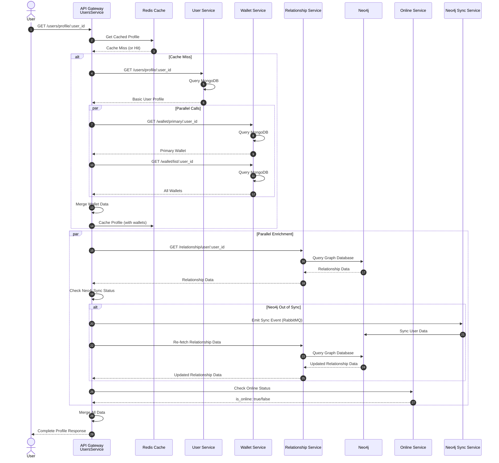

# User Profile Aggregation Flow Diagram

This document provides detailed step-by-step instructions for drawing the user profile aggregation flow diagram, showing how the API Gateway fetches and aggregates user data from multiple microservices.

---

## Overview

When a user requests a profile (their own or another user's), the API Gateway orchestrates data fetching from multiple services:
- **User Service**: Basic user profile data (username, email, display_name, bio, avatar)
- **Wallet Service**: Primary wallet and all linked wallets
- **Relationship Service**: Social graph data (followers, following, mutual connections, blocked status)
- **Online Service**: User's online/offline status
- **Redis Cache**: Cached user data for performance
- **Neo4j Sync**: Ensures user data consistency between MongoDB and Neo4j

The API Gateway uses graceful degradation - if one service fails, it continues with available data rather than failing the entire request.

---

## Diagram Type

**Sequence Diagram** (recommended) - Shows parallel and sequential service calls

---

## Step-by-Step Drawing Instructions

### Actors/Components to Include:
1. **User/Client**
2. **API Gateway** (Port 4000)
   - UsersService
   - CacheService
   - UserServiceClient
   - WalletServiceClient
   - RelationshipServiceClient
   - OnlineService
   - Neo4jDB Sync Service (RabbitMQ)
3. **Redis** (Port 6379) - Cache storage
4. **User Service** (Port 4002)
5. **Wallet Service** (Port 4005)
6. **Relationship Service** (Port 4004)
7. **Neo4j** (Port 7474/7687) - Graph database
8. **Online Service** (via Notification Service or Redis)

---

## Flow Steps:

### Step 1: User Requests Profile
- **User** sends GET request to `/users/profile/:user_id`
- Request includes:
  - `Authorization: Bearer <access_token>` (for authenticated requests)
  - Path parameter: `user_id`
- **API Gateway** receives request
- **API Gateway** validates access token via **AuthGuard** (if authenticated)
- Extracts `current_user_id` from token (if viewing another user's profile)

### Step 2: Check Redis Cache
- **API Gateway** calls `UsersService.getUserProfile()`
- **UsersService** calls `CacheService.getUserData()`
- Query **Redis** for cached user profile:
  - Key format: `user:{user_id}` or similar
  - Value: Complete user profile JSON
- **Decision Point**: Cache hit or miss?

### Step 3A: Cache Hit Path
- If cached data found:
  - Return cached profile data
  - Skip to Step 4 (enrich with relationship data)
- If cache miss → Continue to Step 3B

### Step 3B: Fetch Basic User Profile
- **UsersService** calls `getUserProfileData()` (private method)
- **UsersService** calls `UserServiceClient.getUserProfile()`
- **UserServiceClient** makes HTTP request to **User Service**:
  ```
  GET http://user:4002/users/profile/:user_id
  Headers: { Authorization: Bearer <access_token> }
  ```
- **User Service** queries **MongoDB** users collection:
  ```javascript
  { _id: user_id }
  ```
- Returns basic user data:
  ```json
  {
    "_id": "user123",
    "username": "johndoe",
    "email": "user@example.com",
    "display_name": "John Doe",
    "bio": "Software developer",
    "avatar_ipfs_hash": "Qm...",
    "role": "user",
    "is_active": true
  }
  ```

### Step 4: Fetch Primary Wallet (Parallel Call 1)
- **UsersService** calls `WalletServiceClient.getPrimaryWalletByUserId()`
- **WalletServiceClient** makes HTTP request to **Wallet Service**:
  ```
  GET http://wallet:4005/wallet/primary/:user_id
  Headers: { Authorization: Bearer <access_token> }
  ```
- **Wallet Service** queries **MongoDB** wallets collection:
  ```javascript
  {
    user_id: user_id,
    is_primary: true
  }
  ```
- Returns primary wallet:
  ```json
  {
    "_id": "wallet123",
    "address": "0x1234...abcd",
    "user_id": "user123",
    "is_primary": true,
    "name_service": "johndoe.eth"
  }
  ```
- **Graceful Degradation**: If wallet service fails, log warning and continue with `primary_wallet: undefined`

### Step 5: Fetch All Wallets (Parallel Call 2)
- **UsersService** calls `WalletServiceClient.getWalletsByUserId()`
- **WalletServiceClient** makes HTTP request to **Wallet Service**:
  ```
  GET http://wallet:4005/wallet/list/:user_id
  ```
- **Wallet Service** queries **MongoDB** wallets collection:
  ```javascript
  { user_id: user_id }
  ```
- Returns array of all wallets:
  ```json
  [
    {
      "_id": "wallet123",
      "address": "0x1234...abcd",
      "is_primary": true
    },
    {
      "_id": "wallet456",
      "address": "0x5678...efgh",
      "is_primary": false
    }
  ]
  ```
- **Graceful Degradation**: If wallet service fails, log warning and continue with `wallets: undefined`

### Step 6: Merge Wallet Data
- **UsersService** merges wallet data into user profile:
  ```javascript
  {
    ...user_profile_data,
    primary_wallet: user_primary_wallet_data,
    wallets: user_wallets_data
  }
  ```

### Step 7: Cache User Profile Data
- **UsersService** calls `CacheService.userData()`
- Store complete profile (with wallets) in **Redis**:
  - Key: `user:{user_id}`
  - Value: JSON stringified user profile
  - TTL: Configurable (e.g., 5 minutes)

### Step 8: Fetch Relationship Data (Parallel Call 3)
- **UsersService** calls `RelationshipServiceClient.getUser()`
- **RelationshipServiceClient** makes HTTP request to **Relationship Service**:
  ```
  GET http://relationship:4004/relationship/user/:user_id
  Headers: { Authorization: Bearer <access_token> }
  ```
- **Relationship Service** queries **Neo4j** graph database:
  ```cypher
  MATCH (me:User {user_id: "current_user_id"}), (target:User {user_id: "user_id"})
  OPTIONAL MATCH (me)-[:FOLLOWING]->(target)
  OPTIONAL MATCH (target)-[:FOLLOWING]->(me)
  OPTIONAL MATCH (me)-[:BLOCKED]->(target)
  OPTIONAL MATCH (target)-[:BLOCKED]->(me)
  OPTIONAL MATCH (me)-[:FOLLOWING]->(mutual)<-[:FOLLOWING]-(target)
  RETURN target,
         target.followers_number as followers_number,
         target.following_number as following_number,
         (me)-[:FOLLOWING]->(target) as is_following,
         (target)-[:FOLLOWING]->(me) as is_follower,
         (me)-[:BLOCKED]->(target) as is_blocked,
         (target)-[:BLOCKED]->(me) as is_blocked_by,
         count(mutual) as mutual_followers_number,
         collect(mutual.user_id) as mutual_followers_list
  ```
- Returns relationship data:
  ```json
  {
    "user_id": "user123",
    "followers_number": 150,
    "following_number": 80,
    "is_following": false,
    "is_follower": true,
    "is_blocked": false,
    "is_blocked_by": false,
    "mutual_followers_number": 5,
    "mutual_followers_list": ["user1", "user2", "user3", "user4", "user5"]
  }
  ```

### Step 9: Check Neo4j Sync Status
- **UsersService** calls `syncNeo4jUser()`
- Compares MongoDB user data with Neo4j user node:
  - If Neo4j node doesn't exist → Emit `create_user_request` to RabbitMQ
  - If fields differ (username, role, display_name, avatar_ipfs_hash) → Emit `update_user_request` to RabbitMQ
  - If data matches → No sync needed
- **Neo4j DB Sync Service** consumes message and syncs data
- Wait 1 second for sync to complete
- Re-fetch relationship data if sync occurred

### Step 10: Merge Relationship Data
- **UsersService** merges relationship data into user profile:
  ```javascript
  {
    ...user_profile_data,
    following_number: user_relationship_data.following_number,
    followers_number: user_relationship_data.followers_number,
    is_following: user_relationship_data.is_following,
    is_follower: user_relationship_data.is_follower,
    is_blocked: user_relationship_data.is_blocked,
    is_blocked_by: user_relationship_data.is_blocked_by,
    mutual_followers_number: user_relationship_data.mutual_followers_number,
    mutual_followers_list: user_relationship_data.mutual_followers_list
  }
  ```
- **Graceful Degradation**: If relationship service fails, log warning and continue without relationship data

### Step 11: Fetch Online Status (Parallel Call 4)
- **UsersService** calls `OnlineService.isOnline(user_id)`
- **OnlineService** checks user's online status:
  - May query **Redis** for active WebSocket connections
  - May query **Notification Service** for active sessions
  - Returns boolean: `true` if online, `false` if offline
- **Graceful Degradation**: If online service fails, default to `is_online: false`

### Step 12: Merge Online Status
- **UsersService** adds online status to user profile:
  ```javascript
  {
    ...user_profile_data,
    is_online: isOnline
  }
  ```

### Step 13: Return Aggregated Profile
- **UsersService** returns complete aggregated profile
- **API Gateway** returns to **User**:
  ```json
  {
    "success": true,
    "data": {
      "_id": "user123",
      "username": "johndoe",
      "email": "user@example.com",
      "display_name": "John Doe",
      "bio": "Software developer",
      "avatar_ipfs_hash": "Qm...",
      "role": "user",
      "is_active": true,
      "primary_wallet": {
        "_id": "wallet123",
        "address": "0x1234...abcd",
        "is_primary": true,
        "name_service": "johndoe.eth"
      },
      "wallets": [
        {
          "_id": "wallet123",
          "address": "0x1234...abcd",
          "is_primary": true
        },
        {
          "_id": "wallet456",
          "address": "0x5678...efgh",
          "is_primary": false
        }
      ],
      "followers_number": 150,
      "following_number": 80,
      "is_following": false,
      "is_follower": true,
      "is_blocked": false,
      "is_blocked_by": false,
      "mutual_followers_number": 5,
      "mutual_followers_list": ["user1", "user2", "user3", "user4", "user5"],
      "is_online": true
    }
  }
  ```

---

## Parallel Execution Strategy

The API Gateway can fetch data from multiple services in parallel to reduce latency:

### Parallel Calls:
1. **Wallet Service**: Primary wallet + All wallets (can be parallel)
2. **Relationship Service**: Relationship data
3. **Online Service**: Online status

### Sequential Dependencies:
1. **User Service** must complete first (basic profile needed)
2. **Neo4j Sync** check happens after relationship data fetch
3. **Cache** check happens before all service calls

---

## Graceful Degradation Pattern

The API Gateway implements graceful degradation for each service:

### Wallet Service Failure:
- Log warning: "Failed to fetch primary wallet for user"
- Continue with `primary_wallet: undefined`, `wallets: undefined`
- Response message: "Profile fetched (Wallet data unavailable)"

### Relationship Service Failure:
- Log warning: "Failed to fetch relationship data for user"
- Continue without relationship fields
- Response message: "Profile fetched (User relationship data unavailable)"

### Online Service Failure:
- Log warning: "Failed to check online status for user"
- Default to `is_online: false`
- Continue with profile data

### Cache Failure:
- Log warning: "Cache unavailable"
- Continue with direct service calls
- No caching on response (optional)

---

## Mermaid Sequence Diagram:



---

## Error Handling

### Service Timeout:
- Each service call has timeout (e.g., 10 seconds)
- If timeout occurs → Log warning, continue with available data
- Return partial profile with available data

### Service Unavailable:
- If service returns 503 or connection refused
- Log error with service name
- Continue with graceful degradation
- Return profile with available data

### Invalid Response:
- If service returns unexpected format
- Log error with response details
- Continue without that data
- Return profile with available data

---

## Performance Optimizations

### Caching Strategy:
- **Cache Key**: `user:{user_id}`
- **Cache TTL**: 5 minutes (configurable)
- **Cache Invalidation**: On profile update, wallet link/unlink, follow/unfollow
- **Cache Hit Rate**: Monitor and optimize TTL based on hit rate

### Parallel Execution:
- Use `Promise.all()` or `Promise.allSettled()` for parallel calls
- All service calls can execute simultaneously after basic profile fetch
- Reduces total latency from sum to max of individual calls

### Request Deduplication:
- If multiple requests for same user profile arrive simultaneously
- First request fetches data, subsequent requests wait for result
- Share result across concurrent requests

---

## Data Flow Summary

```
User Request
    ↓
API Gateway (UsersService)
    ↓
[Cache Check] → Redis
    ↓ (miss)
[Basic Profile] → User Service → MongoDB
    ↓
[Parallel Calls]
    ├─→ Wallet Service → MongoDB (primary + all wallets)
    ├─→ Relationship Service → Neo4j (social graph)
    └─→ Online Service → Redis/Notification Service
    ↓
[Merge Data]
    ↓
[Neo4j Sync Check] → RabbitMQ → Neo4j Sync Service
    ↓
[Cache Result] → Redis
    ↓
[Return Aggregated Profile] → User
```

---

## Diagram Creation Guidelines

### Recommended Tools:
- **Sequence Diagrams**: PlantUML, Mermaid, Draw.io, Lucidchart
- **Architecture Diagrams**: Lucidchart, Miro

### Color Coding Standards:
- **Blue**: Normal operations, data flow
- **Green**: Success operations, cache hits
- **Yellow**: Cache operations, optimization
- **Orange**: Parallel operations
- **Red**: Error paths, service failures
- **Purple**: Neo4j sync operations
- **Gray**: Infrastructure components (Redis, MongoDB, Neo4j)

### Symbols to Use:
- **Rectangle**: Process/Service
- **Diamond**: Decision point (cache hit/miss, sync needed)
- **Cylinder**: Database (MongoDB, Neo4j)
- **Cloud**: External service (RabbitMQ)
- **Arrow**: Data flow
- **Dashed Arrow**: Async operation (RabbitMQ)
- **Double Arrow**: Request/Response pair
- **Parallel Box**: Parallel operations (use `par` in Mermaid)
- **Note/Sticky Note**: Graceful degradation notes

### Information to Include:
- Port numbers for all services
- HTTP methods and endpoints
- Database query examples
- Cache key formats
- TTL values
- Timeout values
- Error handling strategies
- Parallel execution patterns

### Best Practices:
1. Show parallel operations clearly
2. Highlight graceful degradation paths
3. Include cache hit/miss decision points
4. Show Neo4j sync check and retry
5. Display all data sources clearly
6. Include error paths for each service
7. Show data merging points
8. Include performance metrics (latency, cache hit rate)

---

**Last Updated**: 2024
**Maintained By**: Decode Development Team
